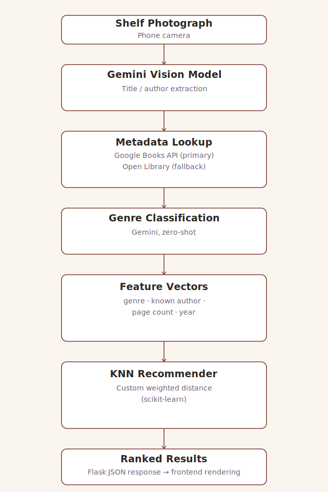

# BiblioFile AI

### An AI-Powered Platform for Book Readers


---

## Overview

BiblioFile AI is an AI-powered web application that helps readers discover their next book from any bookshelf, whether it is at a secondhand bookshop, or a friend's living room. 

Instead of manually searching each title, the user photographs the shelf and receives an instantly ranked list of every book detected, matched against their own taste profile, with direct links out to Goodreads for reviews, synopsis and further reading.

Deployed: https://bibliofileai.netlify.app/

---

## Problem Statement

Physical browsing can be tedious, and current existing tools do not fully fit what is needed.

- Existing platforms like Goodreads and LibraryThing recommend from a user's *entire reading history* against their own catalogue. They have
  no concept of which books are physically in front of the user in the moment
- Manually searching every unfamiliar spine on a phone is slow and breaks the flow of browsing
- Choices end up based on cover design or title alone, rather than genuine fit with a reader's taste

---

## Solution

BiblioFile AI closes that gap with a five-stage pipeline that goes from a single photograph to a personalised, ranked shortlist.

The platform:

- Reads every visible book spine from a single shelf photograph
- Retrieves structured metadata for each detected title
- Classifies each book into a clean, consistent genre
- Ranks the shelf against the user's own saved taste profile
- Links every result straight through to Goodreads

By combining computer vision, structured metadata retrieval, and a custom recommendation model, BiblioFile AI answers not just **what** is on the shelf, but **which of these books this specific reader is most likely to enjoy**.

---

## Key Features

### Shelf Scanning

Photograph any bookshelf and receive a structured list of every book spine the model can read, extracted directly from the image.

### Personalised Ranking

A K-Nearest-Neighbours recommender compares every detected book against the user's own taste profile and highlights the closest matches.

### Taste Profile Onboarding

New users seed their profile with 3-10 books they've already enjoyed, searchable and added within seconds.

### Save and Revisit

Any book from a scan can be starred and revisited later from a personal library, separate from the onboarding taste profile.

### Goodreads Deep-Linking

Every result links directly to a title-scoped Goodreads search, giving the user reviews and further detail with one tap.

---

## Technology Stack

### AI / Machine Learning

| Tool               | Purpose                                                 |
| ------------------- | -------------------------------------------------------- |
| Google Gemini        | Vision-based spine extraction and genre classification  |
| Google Books API      | Primary book metadata retrieval                        |
| Open Library API      | Fallback metadata source                                |
| scikit-learn (KNN)    | Custom-weighted nearest-neighbours recommendation       |

### Development Tools

| Tool             | Purpose                                    |
| ----------------- | -------------------------------------------- |
| Python 3.10+       | Backend logic and ML pipeline               |
| Flask              | REST API connecting frontend and pipeline   |
| Pandas / NumPy     | Metadata processing and feature vectors     |
| HTML / CSS / JS    | Frontend interface, no framework            |
| Figma              | Design system and interactive prototype     |
| GitHub             | Version control and collaboration           |
| Netlify / Render   | Frontend and backend deployment             |

---

## System Architecture



---

## Setup and Running Instructions

## Setup and Running Instructions

### Prerequisites

- Python 3.10+
- A modern web browser
- Up to four free [Gemini API keys](https://aistudio.google.com/apikey) (the app rotates across up to four keys to handle free-tier rate limits; one is enough to run, but fewer keys means faster quota exhaustion)
- Up to four free [Google Books API keys](https://console.cloud.google.com/) (same rotation logic; one is sufficient to run)

### Backend

```bash
cd backend
pip install -r requirements.txt --break-system-packages
```

Create a `.env` file inside `backend/` with your API keys, using exactly these variable names:

GEMINI_API_KEY_1=your_key_here
GEMINI_API_KEY_2=
GEMINI_API_KEY_3=
GEMINI_API_KEY_4=
GOOGLE_BOOKS_API_KEY_1=your_key_here
GOOGLE_BOOKS_API_KEY_2=
GOOGLE_BOOKS_API_KEY_3=
GOOGLE_BOOKS_API_KEY_4=


Only the first key of each is required to run the app; the remaining slots can be left blank and are used for automatic rotation if you have additional keys. You will need to generate your own API keys for both Gemini and Google Books.

Run the server from inside the `backend/` directory. The runtime caches (`../data/api_cache.json`, image and genre caches) are created at relative paths, so running from the project root will place them incorrectly:

```bash
python app.py
```

### Frontend

```bash
cd frontend
```

Serve `index.html` with a local server (e.g. VS Code's Live Server extension, or `python -m http.server`). Opening the file directly via `file://` will not work, as the app fetches local JSON over `fetch()`.

**Note:** `script.js` currently points `API_BASE` at the deployed backend (`https://bookshelf-scanner-ecs7036.onrender.com`). To test the frontend against a locally running backend instead, change this line in `script.js` to `http://localhost:5000` before serving.

### Full application

1. Start the backend (from `backend/`).
2. Serve the frontend.
3. Open the frontend URL in a browser (or on a phone, for camera testing).
4. Complete onboarding with 3–10 books you've enjoyed.
5. Scan a shelf to see ranked recommendations.

**Live deployment:** https://bibliofileai.netlify.app/

---

## Dataset

No publicly available dataset is used. 

This project synthesises its dataset by merging three data streams:

- User profile: a baseline of self-reported books to establish a sense of the user’s reading preferences.

- Active shelf data: Book titles and authors extracted from user uploaded bookshelf photos using a VLM.

- Metadata from APIs: bibliographic details taken from Google Books and Open Library.

This combined data is cached locally and used to inform our k-NN model.

---

## Team Members

| Name    | Role                                                                  |
| ------- | ---------------------------------------------------------------------- |
| Katy    | LLM prompt design & vision extraction and genre classification         |
| Emma    | Google Books / Open Library integration, feature vector construction   |
| Alexa   | Flask backend, KNN recommender logic, storage                          |
| Anna    | Figma design system, CSS/HTML/JS front-end implementation              |

---

## Future Enhancements

- Make the app handle multiple users at once more reliably
- Recommend books based on other users with similar taste, not just one person's own saved books
- Improve photo capture in low light, so spines are easier to read
- Add an in-app image quality check before a scan is sent, so a blurry photo can be flagged before it wastes an API call
- Move to paid persistent storage, or a lightweight database, so saved profiles survive
- Speed up scans with a paid API tier, or by batching metadata requests instead of looking up each book sequentially

---

## Impact

While artificial intelligence might often be viewed as *antithetical* to the simple joys of reading, BiblioFile AI makes use of this technology to actually enhance the physical experience. It takes the somewhat overwhelming task out of browsing a bookshelf, making the act of browsing more personalised, and thus, more enjoyable.

---

*Developed for ECS7036P Applications of AI, Queen Mary University of London.*
